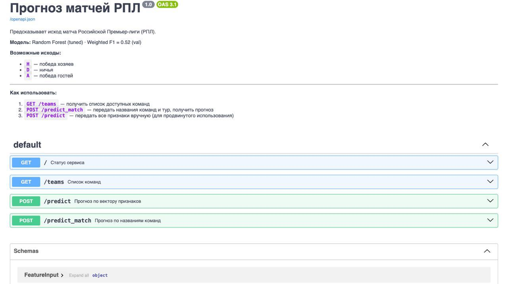
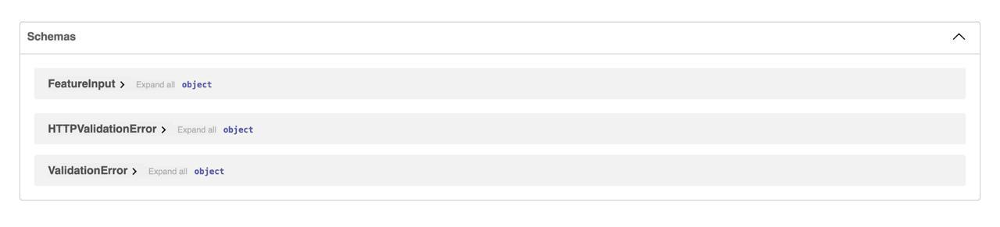
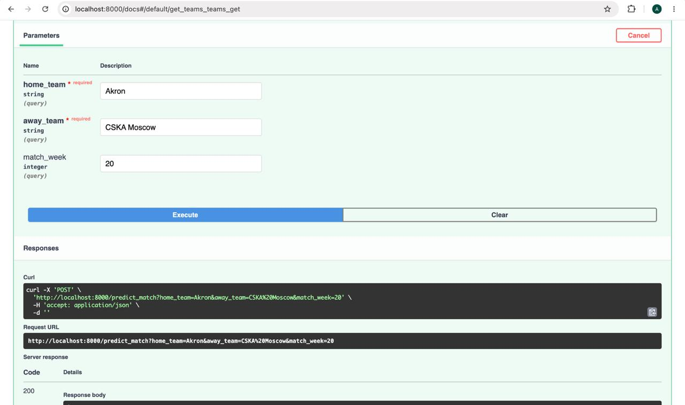
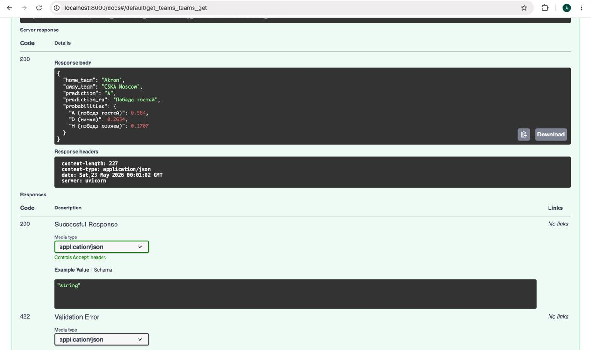
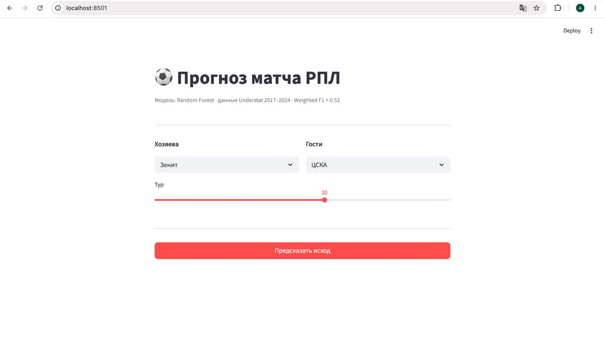
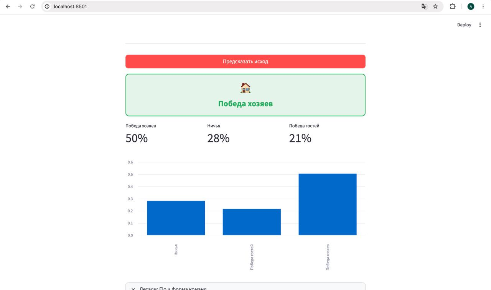
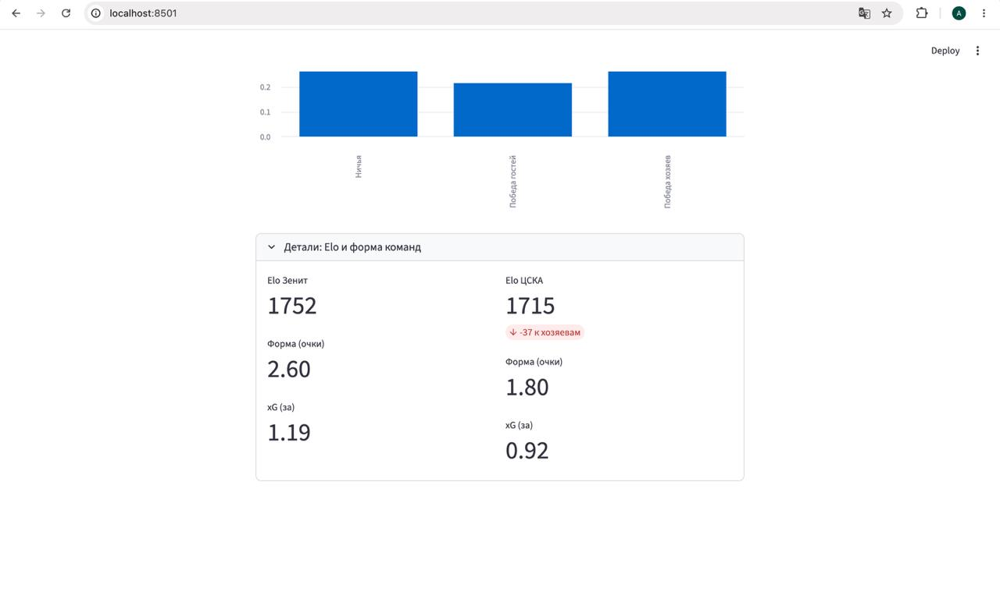

# Отчёт: Прогнозирование исходов матчей РПЛ

**Студент:** Елизарова Анастасия Александровна · **Группа:** БИВ233

---

## 1. Введение и постановка задачи

**Задача:** Предсказать исход футбольного матча Российской Премьер-лиги с точки зрения хозяев поля — победа хозяев (H), ничья (D) или победа гостей (A). Это задача многоклассовой классификации.

**Почему эта задача:** Мне интересна тема спорта, и предсказание исходов матчей с помощью ML — одно из самых прикладных применений, которые можно придумать в этой области. Футбол при этом особенно сложен: случайности здесь больше, чем в большинстве других задач классификации.

**Метрика качества: Weighted F1-score**

В данных умеренный дисбаланс классов: ~45% побед хозяев, ~25% ничьих, ~30% побед гостей. Accuracy в этом случае завышает реальное качество — модель, которая всегда предсказывает H, даст accuracy ≈ 45%, но ничего не предскажет для D и A. Weighted F1 учитывает долю каждого класса и штрафует за игнорирование редких классов. Accuracy приводится дополнительно для сравнения с публичными бенчмарками.

---

## 2. Поиск и описание данных

Данные собраны **самостоятельно** с двух открытых источников:

| Источник | Данные | Метод |
|---|---|---|
| [Understat.com](https://understat.com/league/RPL) | xG, xGA, голы, дата — все матчи РПЛ 2017–2024 | HTTP-запросы + извлечение JSON из JS-переменных через regex |
| [FBref.com](https://fbref.com) | Расписание и командная статистика | Библиотека `soccerdata` |

**Датасет:** 1 912 завершённых матчей × 33 колонки (8 сезонов, 2017–2024).

Understat выбран как единственный бесплатный источник исторических xG-данных для РПЛ с 2017 года. xG (expected goals) — ключевая метрика современного футбольного анализа.

---

## 3. Обработка и подготовка данных

### Feature Engineering

Из сырых данных (голы, xG, дата, команды) вычислены следующие признаки:

| Группа | Признаки | Описание |
|---|---|---|
| Rolling xG | `home/away_roll_xg_for/against` | Среднее xG за последние 5 матчей |
| Rolling голы | `home/away_roll_goals_for/against` | Средние голы за последние 5 матчей |
| Форма | `home/away_roll_pts` | Средние очки за последние 5 матчей |
| Venue-форма | `home/away_venue_form` | Форма только дома / только в гостях |
| Head-to-Head | `h2h_home_win_rate`, `h2h_draw_rate`, `h2h_away_win_rate` | Доля исходов в личных встречах (последние 5) |
| Elo-рейтинг | `home/away_elo`, `elo_diff` | Накопительный рейтинг, K=32 |
| Усталость | `home/away_days_rest` | Дней отдыха с последнего матча |
| Тур | `match_week` | Порядковый номер матча в сезоне |

Итого: **21 признак**.

### Предобработка

- **Дубликаты:** удалены по `match_id`
- **Пропуски:** возникают только в начале сезонов, когда rolling-окно недостаточно заполнено. Заполнены медианой по тренировочной выборке (`SimpleImputer`)
- **Выбросы:** clip по 5σ (реальных выбросов не обнаружено)

### Темпоральный сплит

| Сплит | Сезоны | Матчей |
|---|---|---|
| Train | 2017–2021 | ~1 192 |
| Val | 2022 | ~240 |
| Test | 2023–2024 | ~480 |

Случайное перемешивание недопустимо: rolling-фичи и Elo вычисляются по предыдущим матчам, перемешивание создало бы утечку данных из будущего.

---

## 4. Baseline-модель

**Majority Class:** всегда предсказывает победу хозяев (H) — самый частый класс.

**Logistic Regression:** стандартизация (`StandardScaler`) + многоклассовая логистическая регрессия (softmax, L2, C=1.0).

| Модель | Weighted F1 (val) | Accuracy (val) |
|---|---|---|
| Majority Class | 0.3014 | 0.4708 |
| Logistic Regression | 0.4724 | 0.5375 |

LR сразу даёт прирост ~17 п.п. по F1, но совсем не предсказывает ничьи (F1_D = 0.00) — линейная граница не улавливает закономерности для ничьей.

---

## 5. Эксперименты

Все эксперименты с `random_state=42`, подбор гиперпараметров через Optuna (30 триалов, TPE sampler).

### Эксперимент 1 — Random Forest (default)

**Гипотеза:** Ансамбль деревьев уловит нелинейные зависимости между Elo, формой и xG лучше, чем линейная модель.

**Как проверялось:** `RandomForestClassifier(n_estimators=200)`, дефолтные параметры.

**Результат:** Weighted F1 (val) = **0.5032** — прирост +3 п.п. к LR. Гипотеза подтверждена.

---

### Эксперимент 2 — Random Forest (tuned)

**Гипотеза:** Настройка глубины деревьев и минимального числа сэмплов предотвратит переобучение и улучшит обобщение.

**Как проверялось:** Optuna, 30 триалов. Подбирались: `n_estimators`, `max_depth`, `min_samples_split`, `min_samples_leaf`, `max_features`.

Лучшие параметры: `n_estimators=500, max_depth=17, min_samples_split=20, min_samples_leaf=6, max_features=0.5`

**Результат:** Weighted F1 (val) = **0.5217** (+2 п.п. к default RF). Гипотеза подтверждена.

---

### Эксперимент 3 — LightGBM (default)

**Гипотеза:** Градиентный бустинг даст более высокую метрику за счёт последовательного исправления ошибок предыдущих деревьев.

**Как проверялось:** `LGBMClassifier(n_estimators=300)`, дефолтные параметры.

**Результат:** Weighted F1 (val) = **0.4692** — неожиданно хуже RF default. Дефолтные параметры LGB переобучаются на небольшом датасете (~1 200 матчей).

---

### Эксперимент 4 — LightGBM (tuned)

**Гипотеза:** После подбора регуляризации и learning rate LGB догонит RF.

**Как проверялось:** Optuna, 30 триалов. Подбирались: `learning_rate`, `num_leaves`, `max_depth`, `subsample`, `colsample_bytree`, `reg_alpha`, `reg_lambda`.

Лучшие параметры: `learning_rate=0.014, num_leaves=102, max_depth=5, min_child_samples=17`

**Результат:** Weighted F1 (val) = **0.5175** — приблизился к RF tuned, но не превзошёл. На маленьком датасете RF оказался устойчивее.

---

### Эксперимент 5 — Ablation Study (LightGBM tuned)

**Гипотеза:** Elo и xG-признаки несут наибольший сигнал.

**Как проверялось:** Последовательно убирали группы признаков и измеряли падение F1.

| Набор признаков | Признаков | Weighted F1 (val) | Δ к full |
|---|---|---|---|
| Все признаки | 21 | 0.5175 | — |
| Без H2H | 18 | 0.5089 | −0.009 |
| Без days_rest | 19 | 0.5052 | −0.012 |
| Без venue_form | 19 | 0.5047 | −0.013 |
| Без xG | 17 | 0.4886 | −0.029 |
| Без Elo | 18 | 0.4789 | −0.039 |
| Только Elo+xG | 7 | 0.4783 | −0.039 |

**Результат:** Гипотеза подтверждена — Elo даёт наибольший вклад (−3.9 п.п. при удалении). xG на втором месте (−2.9 п.п.). H2H и days_rest почти не влияют на небольшом датасете РПЛ.

---

### Сводная таблица всех экспериментов

| Модель | Weighted F1 (val) | Accuracy (val) | Weighted F1 (test) |
|---|---|---|---|
| Majority Class | 0.3014 | 0.4708 | 0.2793 |
| Logistic Regression | 0.4724 | 0.5375 | 0.4314 |
| LightGBM (default) | 0.4692 | 0.4833 | — |
| Random Forest (default) | 0.5032 | 0.5500 | — |
| LightGBM (tuned) | 0.5175 | 0.5667 | — |
| **Random Forest (tuned)** | **0.5217** | **0.5750** | **0.4609** |

---

## 6. Финальная модель и интерпретируемость

**Выбранная модель:** Random Forest (tuned), как лучшая по Weighted F1 на val.

**Финальная оценка на test:** Weighted F1 = **0.4609**, Accuracy = **0.5271**

Падение с val (0.52) на test (0.46) ожидаемо — сезоны 2023–2024 сложнее для прогнозирования из-за изменений состава команд и исключения клубов из РПЛ после 2022 года.

### Важность признаков (Random Forest)

По `feature_importances_` наиболее значимые признаки:

1. **elo_diff** — разница Elo-рейтингов: главный предиктор силы команд
2. **home_elo / away_elo** — абсолютные рейтинги
3. **home_roll_pts / away_roll_pts** — текущая форма (очки за 5 матчей)
4. **home_roll_xg_for / away_roll_xg_for** — xG-форма
5. **match_week** — номер тура (в начале сезона больше неопределённости)

Это согласуется с ablation study: Elo и xG — главные группы признаков.

### Ограничения модели

- Ничьи плохо предсказываются (F1_D ≈ 0.08–0.15) — это известная проблема всех моделей прогнозирования футбола: ничья слишком часто случается «случайно»
- Датасет небольшой (~1 200 матчей в train) — сложно уловить тонкие закономерности
- Модель не учитывает состав команды (травмы, дисквалификации)

---

## 7. Деплой

### FastAPI

REST API с двумя эндпоинтами предсказания:

- `GET /` — статус сервиса
- `GET /teams` — список всех команд в данных
- `POST /predict` — предсказание по явному вектору признаков
- `POST /predict_match?home_team=...&away_team=...` — предсказание по названиям команд (признаки берутся из последних матчей)

Пример запроса:
```bash
curl -X POST "http://localhost:8000/predict_match?home_team=Zenit%20St.%20Petersburg&away_team=CSKA%20Moscow"
```

Swagger UI доступен на `http://localhost:8000/docs`.

### Streamlit

Веб-интерфейс: выбор хозяев и гостей через дропдаун → кнопка «Предсказать» → результат с цветовой индикацией и графиком вероятностей.

### Запуск

```bash
# FastAPI
uvicorn api.main:app --reload
# Streamlit
streamlit run app/streamlit_app.py
# Всё через Docker
docker-compose up --build
```

**Видео демонстрации:** [https://disk.360.yandex.ru/i/5cNmoMoCrYUaig](https://disk.360.yandex.ru/i/5cNmoMoCrYUaig)

**FastAPI — главная страница Swagger UI (/docs)**



*Русскоязычное описание API, 4 эндпоинта: GET /, GET /teams, POST /predict, POST /predict_match*

---

**FastAPI — схемы данных (Schemas)**



*Автоматически сгенерированные схемы: FeatureInput (21 признак), HTTPValidationError*

---

**FastAPI — запрос к /predict_match (Try it out)**



*Пример запроса: Акрон (хозяева) против ЦСКА (гости), тур 20*

---

**FastAPI — ответ /predict_match**



*Результат: победа гостей (A), вероятности: A=0.564, D=0.265, H=0.171*

---

**Streamlit — интерфейс до предсказания**



*Выбор команд через дропдаун (Зенит vs ЦСКА), слайдер тура*

---

**Streamlit — результат предсказания**



*Победа хозяев (зелёный блок): вероятности 50% / 28% / 21%, столбчатая диаграмма*

---

**Streamlit — детали: Elo и форма команд**



*Elo Зенит 1752 / ЦСКА 1715, форма 2.60 / 1.80, xG 1.19 / 0.92*

---

## 8. Заключение и выводы

Построена модель многоклассовой классификации исходов матчей РПЛ. Лучший результат — **Random Forest (tuned)**: Weighted F1 = 0.52 (val) / 0.46 (test).

**Что работает хорошо:** победы хозяев предсказываются неплохо (F1_H ≈ 0.66–0.71). Elo-рейтинг оказался самым важным признаком.

**Что не работает:** ничьи (F1_D ≈ 0.08) — классическая проблема всех футбольных прогнозных моделей. Победы гостей предсказываются умеренно (F1_A ≈ 0.51).

**Возможные улучшения:**
- Добавить данные о составах (травмы, дисквалификации) — ключевой недостающий сигнал
- Попробовать калибровку вероятностей (Platt scaling) для улучшения предсказания ничьих
- Расширить датасет за счёт более ранних сезонов или смежных лиг
